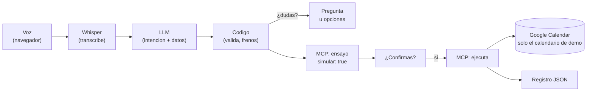

# Agente de voz: tu asistente de calendario

[](https://github.com/ignaciothepower/agente-voz/actions/workflows/ci.yml)

Le hablas al movil, te entiende y gestiona tu Google Calendar: crea, consulta, mueve y borra eventos.
Y nunca cambia nada sin que le digas que si.

- **En produccion:** https://agente-voz-five.vercel.app (con clave de acceso: actua sobre un calendario real)
- **Coste:** cero. Whisper corre en tu navegador, el LLM es la capa gratuita de Gemini, Vercel Hobby, GitHub Actions.
- Proyecto del Master de Desarrollo Agentico (The Power), bloque P2, 4 sesiones.

## Arquitectura



| Etapa | En local (`npm run dev`) | En produccion (Vercel) |
|---|---|---|
| 1 · Captura | `getUserMedia` + `MediaRecorder` (webm/opus) | igual (HTTPS obligatorio para el microfono) |
| 2 · Transcripcion | Whisper small en Python (`stt/`), con vocabulario | Whisper base **en el navegador** (Transformers.js) |
| 3 · Intencion | llama3.1 en Ollama | Gemini (capa gratuita), con reintento y modelo de respaldo |
| 4 · Accion | MCP por stdio (proceso hijo) | el mismo MCP, conectado en memoria |
| 5 · Respuesta | texto + `SpeechSynthesis` | igual |

El codigo es el mismo: lo que cambia se elige con variables de entorno (ver `docs/DESPLIEGUE.md`).

## Lo que lo hace seguro

Un agente que actua sobre tu vida real necesita un freno humano.

- **Confirmacion humana.** Crear, mover y borrar pasan antes por un **ensayo** en el MCP (`simular: true`): se localiza el
  evento, se validan los datos y se avisa de solapes, sin tocar nada. El agente lee el resumen ("Voy a borrar... ¿Confirmas?")
  y solo un **si corto y claro** ejecuta ("si puedes mover..." no es un si). La confirmacion caduca a los 2 minutos.
- **Guardarrailes en codigo** (`src/lib/guardarrailes.ts`): nada en el pasado, duraciones de 5 min a 8 h, un año vista como
  maximo, 5 cambios cada 10 minutos, nada masivo ("borra todo"), y fuera de alcance educado ("solo puedo gestionar tu calendario").
- **Validacion de lo que dice el LLM** (`src/lib/validar.ts`): fechas relativas calculadas en codigo, horas y eventos que el
  usuario no dijo -> fuera, tildes recuperadas.
- **Permiso minimo de Google:** `calendar.app.created`. El agente solo ve y toca el calendario que el mismo creo.
- **Registro:** cada accion, freno o cancelacion deja una linea JSON (`logs/acciones.jsonl` en local, logs de Vercel en produccion).
- **Secretos fuera del codigo:** `.env.local` en `.gitignore`, escaner de credenciales en el CI, cookie de la conversacion
  firmada (HMAC) y clave de acceso (`APP_CLAVE`) delante de toda la app publicada.

## Probado de verdad (hallazgos)

Todo esto salio probando con grabaciones reales y un calendario real, y cada uno tiene su arreglo:

| Lo que paso | El arreglo |
|---|---|
| llama3.1 dijo que "el jueves" era el miercoles 30 | las fechas relativas se calculan en codigo |
| Una prueba "sin efectos" de "la cita con el lentista" **borro al dentista** | busqueda estricta; borrar por descripcion nunca es directo |
| La regla del si de la S3 confirmaba con "te voy a pedir por favor **si** puedes mover..." | solo un si corto y claro |
| "No, cancela." sin nada pendiente se entendio como **borra la ultima reunion** | la confirmacion lo paro: pregunto antes de borrar |
| El ensayo aceptaba crear una reunion que ya existia a esa hora | aviso de solape en el "¿confirmas?" |
| `gemini-2.5-flash` ya no admite usuarios nuevos; 3.8 "piensa" y agotaba 200 tokens | modelo actual, tope de 2048, reintento y respaldo ante 503 |
| Whisper base en el navegador oyo "Cree un Arrunian" (reunion) | el LLM y la validacion lo recuperan; en local, small + vocabulario |

## Puesta en marcha (local)

1. `npm install` (Node 24: ejecuta TypeScript directamente)
2. Whisper: un entorno de Python con `pip install -r stt/requirements.txt` y `python stt/servidor.py`
   (la primera vez descarga el modelo small, ~460 MB).
3. Ollama con `llama3.1`.
4. Google Cloud (gratis): proyecto -> activar Google Calendar API -> pantalla de consentimiento (Interno con Workspace;
   si no, Externo en modo prueba) -> cliente OAuth "Aplicacion web" con el redirect `http://localhost:3000/api/google/callback`.
5. `cp .env.example .env.local` y pega GOOGLE_CLIENT_ID y GOOGLE_CLIENT_SECRET.
6. `npm run dev`, abre http://localhost:3000 y pulsa "Conectar Google Calendar": la app guarda el token y crea su propio
   calendario "Agente de voz (demo)".

Para probar en local el modo produccion: `?stt=navegador` en la URL (Whisper en el navegador) y `LLM=gemini` con tu
`GEMINI_API_KEY` (gratis en aistudio.google.com, sin tarjeta).

## Desplegar

Guia completa en `docs/DESPLIEGUE.md`: importar el repositorio en Vercel, pegar las variables de `.env.local` y anadir
`LLM=gemini`, `NEXT_PUBLIC_STT=navegador` y `APP_CLAVE`. Cada push a `main` despliega y el CI comprueba lo mismo en paralelo.

## Comprobaciones

- `npm test` · 13 tests con `node:test` (frenos, confirmacion, validacion, cookie firmada), sin librerias.
- `npm run secretos` · busca credenciales en todo lo que git va a subir.
- `node --env-file=.env.local scripts/conversacion.ts "frase" "si" --- "otra conversacion"` · el agente desde la terminal.
- `node scripts/probar-confirmacion.ts transcripciones.json` · que frases cuentan como si.
- `LLM=gemini node --env-file=.env.local scripts/probar-intencion-llm.ts "frase"` · la intencion con Gemini.
- `python mcp/cliente_jsonrpc.py mcp/servidor.ts list` · los mensajes MCP en crudo.

## Estructura

```
src/components/BotonHablar.tsx   captura, Whisper en el navegador, Si/No y voz de vuelta
public/whisper-worker.js         Whisper (Transformers.js) en un Web Worker
src/app/api/agente/              el turno completo; memoria en cookie firmada (src/lib/sesion.ts)
src/lib/intencion.ts             LLM: llama3.1 (Ollama) o Gemini, el mismo esquema de acciones
src/lib/agente.ts                el host: ambiguedad, confirmacion, frenos, memoria
src/lib/guardarrailes.ts         los frenos y el registro
src/lib/validar.ts               lo que dice el LLM, comprobado en codigo
src/lib/mcp-servidor.ts          el servidor MCP del calendario (mcp/servidor.ts lo sirve por stdio)
src/lib/calendario.ts            las 4 acciones con ensayo, solapes y motivos (falta, ambiguo, freno...)
src/lib/google.ts                OAuth 2.0 y Calendar API con fetch
src/middleware.ts                la clave de acceso de la version publicada
stt/                             Whisper local en Python
tests/ · .github/workflows/      tests y CI
```
